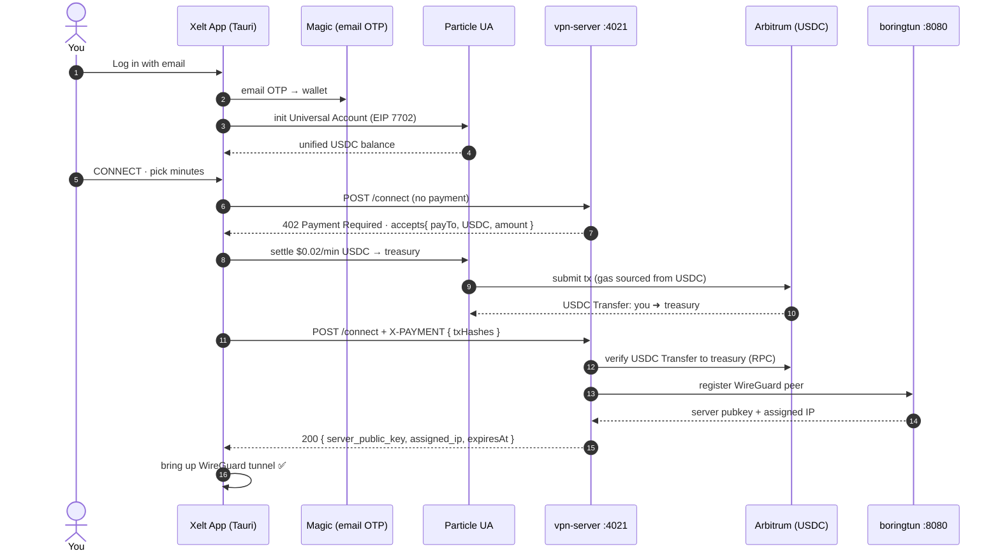

<div align="center">

# Xelt

**Pay as you go VPN. Buy privacy by the minute, settled in USDC on Arbitrum.**

No account. No subscription. No card. Log in with an email, pay a few cents in USDC over an
HTTP 402 payment handshake, and get an encrypted **WireGuard** tunnel for exactly
the minutes you bought.


[Live on Arbitrum](#live-on-arbitrum) · [How it works](#how-it-works) · [Quickstart](#quickstart) · [Architecture](#architecture)

</div>

---

## Why Xelt

Every other VPN wants an account, a card, and a monthly plan, even for ten minutes at an airport.
Xelt strips that away:

- **Log in with an email.** A [Magic](https://magic.link) embedded wallet is created for you. No seed phrase, no extension, no password.
- **Pay by the minute.** Buy 1 minute or 60. The session auto expires when the time is up, and you owe nothing after.
- **Pay from any chain.** [Particle Universal Accounts](https://developers.particle.network/) source your USDC across chains and settle on Arbitrum. You never hold a gas token.
- **Real encryption.** A genuine WireGuard tunnel, not a proxy.

---

## Live on Arbitrum

Xelt is not a mock. **Every session is a real USDC payment on Arbitrum One**, driven by an HTTP 402
payment handshake and settled onchain. All of it is public and verifiable.

### The payment handshake

Xelt gates each session behind HTTP `402 Payment Required`: the client pays, then retries with the
receipt. Here is one real session, end to end.

```http
# step 1: client asks to connect, no payment yet
POST /connect
{ "wireguardPublicKey": "…", "durationMinutes": 1 }

# server answers with the payment challenge (the requirements)
HTTP/1.1 402 Payment Required
{
  "accepts": [{
    "scheme":   "ua-arbitrum-usdc",
    "network":  "eip155:42161",
    "payTo":    "0x3d2b05eE2457B174DE4dC53e714db52B1F8B4573",
    "asset":    "0xaf88d065e77c8cC2239327C5EDb3A432268e5831",
    "amount":   "0.02",
    "currency": "USDC"
  }]
}

# step 2: the wallet settles 0.02 USDC to payTo on Arbitrum  (the tx below)

# step 3: client retries the SAME request, carrying the receipt
POST /connect
X-PAYMENT: base64({ "scheme":"ua", "txHashes":["0xa20a69…c836c0"], "payerAddress":"0xC954…2FBC" })
{ "wireguardPublicKey": "…", "durationMinutes": 1 }

# server verifies that USDC Transfer on Arbitrum (payTo + amount) and opens the tunnel
HTTP/1.1 200 OK
{ "server_public_key": "…", "assigned_ip": "10.x.x.x", "expiresAt": "…" }
```

The `payTo`, `asset`, and `amount` in the `402` are exactly what lands onchain. That binding of
challenge, settlement, and redemption is the payment. (The `402` advertises a custom
`ua-arbitrum-usdc` settlement scheme, which the server verifies against the onchain transfer.)

### Onchain settlements

Verify any of it yourself:

- **Treasury** (receives every payment): [`0x3d2b05…8B4573`](https://arbiscan.io/address/0x3d2b05eE2457B174DE4dC53e714db52B1F8B4573)
- **Asset** (USDC on Arbitrum): [`0xaf88d0…8e5831`](https://arbiscan.io/token/0xaf88d065e77c8cC2239327C5EDb3A432268e5831)

| Amount | Date | Transaction |
|--------|------|-------------|
| 0.02 USDC | Jul 10, 2026 | [`0xa20a69…c836c0`](https://arbiscan.io/tx/0xa20a69125f909bdce991f67af17318fef9ccadcdd22a407d7326b40432c836c0) |
| 0.02 USDC | Jul 10, 2026 | [`0x1255f9…ba137f`](https://arbiscan.io/tx/0x1255f9ffb05e94fad7a7a18731aa12f3d142cd7c7bfd1ea3da914f47a8ba137f) |
| 0.02 USDC | Jul&nbsp;9,&nbsp;2026 | [`0xc986c7…582cd3`](https://arbiscan.io/tx/0xc986c7e65dec49b8f3d89285716c5037b4104fed8da886298c18fcf71c582cd3) |
| 0.02 USDC | Jul&nbsp;9,&nbsp;2026 | [`0xa7f5cf…a2276b`](https://arbiscan.io/tx/0xa7f5cf7aa6e810bd8c62c1476d1417d0e497ddf0e59c5f28a2597f6fb6a2276b) |

The top row is the settlement from the handshake above. Each row is one paid minute: a real USDC
transfer from a Magic wallet to the Xelt treasury that unlocked a WireGuard tunnel. The server never
trusts the client or an indexer; it re reads the USDC `Transfer` log on Arbitrum and checks `to` and
`amount` before opening the tunnel.

---

## Chain abstracted with EIP 7702

Magic gives each user an ordinary EOA at sign in. Particle Universal Accounts then upgrades **that
same EOA in place** with EIP 7702: no new address, no smart account to deploy, no migration. One
login, one balance, and the wallet can spend on any chain with any asset.

The upgrade is visible onchain. The login wallet keeps its address but now runs a 7702 delegation
that points at Particle's Universal Accounts implementation:

```
login wallet   0xC954cb30C3423a0f73Fdd89afD47057168482FBC   (address never changes)
onchain code   0xef010013e00e089f81ad9f36b655c9e9a07c6bf1489a5a
```

`0xef0100` is the EIP 7702 delegation marker; the rest, `0x13e00e089f81ad9f36b655c9e9a07c6bf1489a5a`,
is the Particle UA implementation the wallet now delegates to. Verify it:
[wallet on Arbiscan](https://arbiscan.io/address/0xC954cb30C3423a0f73Fdd89afD47057168482FBC) ·
[UA implementation](https://arbiscan.io/address/0x13e00e089f81ad9f36b655c9e9a07c6bf1489a5a). For
contrast, the treasury in the settlements above is a plain EOA with no code.

Because the wallet is now a Universal Account, one balance spans chains:

- **Recharge (any chain → Arbitrum)** is a single UA operation that pulls USDC from wherever you hold
  it and settles it on Arbitrum. Value moves across chains with no bridge screen and no gas token to
  top up.
- **Per use payments** settle on Arbitrum and can draw from a balance you hold on another chain, so a
  session can be paid without holding anything on Arbitrum first.

A genuinely cross chain settlement leaves a linked pair of transactions, one on the origin chain and
one on Arbitrum: one login, one balance, value delivered where the service asks for it.

---

## How it works

The client logs you in with Magic, spins up a Particle Universal Account over your wallet
(EIP&nbsp;7702), and settles each session in USDC on Arbitrum. The server gates each session behind HTTP 402: it answers an
unpaid request with `402` plus a price, then verifies the **onchain USDC transfer** before opening
the tunnel.



---

## Fund once, then pay per use

You do not pay across chains on every connect. The app has a **Recharge (any chain → Arbitrum)**
action that tops up your Arbitrum USDC balance once through Universal Accounts. After that, each
`/connect` and `/renew` settles $0.02 per minute straight from that balance.

```
Recharge $5  ──UA──▶  Arbitrum USDC balance
                              │
     connect 5m ─▶ settle $0.10 USDC  ┐
     renew 5m   ─▶ settle $0.10 USDC  ├─ per use, from your balance
     renew 1m   ─▶ settle $0.02 USDC  ┘
```

Each settlement carries a small Universal Accounts network fee (about $0.028, taken in USDC, so you
never need to hold ETH). Pricing defaults to `$0.02` per minute (`PRICE_PER_MINUTE_USD`).

---

## Architecture

```
                          PAYMENT LAYER
   ┌──────────────────────────────────────────────────────────────┐
   │  Magic (email login) ─▶ Particle UA (EIP 7702)                │
   │                              │  settle USDC                   │
   │                              ▼                                │
   │        Arbitrum One ── USDC Transfer ──▶ Treasury             │
   └──────────────────────────────────────────────────────────────┘
                    │  server re-verifies the transfer onchain
                    ▼
   ┌─────────────────┐   WireGuard peer cfg    ┌──────────────────────┐
   │    Xelt App     │ ──────────────────────▶ │   vpn-server :4021    │
   │     (Tauri)     │ ◀────────────────────── │   /connect /renew ... │
   └────────┬────────┘   server pubkey + IP    └──────────┬───────────┘
            │                                              │ POST /v1/register
            │        WireGuard tunnel (UDP :51820)         ▼
            └─────────────────────────────────▶ ┌──────────────────────┐
                                                │   boringtun  :8080   │
                                                │   WireGuard server   │
                                                └──────────────────────┘
```

### Endpoints (`vpn-server`)

| Method · path | Auth | Purpose |
|---------------|------|---------|
| `POST /connect` | HTTP 402 (`402` → pay → retry) | Buy a new session |
| `POST /renew` | HTTP 402 | Extend the active session (last 30s before expiry) |
| `POST /session/clear` | free | Drop the session and WireGuard peer |
| `GET /pricing?durationMinutes=N` | free | Quote a price |
| `GET /session/:wireguardPublicKey` | free | Session status and seconds remaining |
| `GET /health` · `GET /info` | free | Health and service metadata |

### Built with

| Layer | Tech |
|-------|------|
| Login and wallet | Magic (email OTP embedded wallet) |
| Payments | Particle Universal Accounts (EIP 7702), chain abstracted USDC settlement |
| Settlement | Arbitrum One, USDC |
| Protocol | HTTP 402 pay per use (challenge, pay, retry) |
| Tunnel | WireGuard (boringtun) |
| App | Tauri (Rust and WebView) |

---

## Repo layout

```
xelt/
├── client/                          # Tauri desktop app (React WebView + Rust core)
│   ├── src/wallet/                  #   Magic login + Particle UA settlement layer
│   │   ├── magic.ts                 #     email OTP login → wallet + viem client
│   │   ├── ua.ts                    #     Universal Accounts: balance, recharge, payExternal
│   │   ├── config.ts                #     Arbitrum / USDC / Magic + Particle keys
│   │   └── index.ts                 #     public wallet API
│   ├── src/utils/vpnFlow.ts         #   pay per use connect/renew (402 → UA settle → verify → tunnel)
│   ├── src/App.tsx                  #   UI: login, balance, recharge, buy/renew minutes
│   ├── src/landing/                 #   marketing landing page
│   └── src-tauri/                   #   Rust: WireGuard tunnel control + key storage
├── vpn-server/                      # pay per use resource server (Hono)
│   ├── index.ts                     #   402 gate + payment verify + peer registration
│   └── services/paymentVerify.ts    #   onchain USDC Transfer verification (Arbitrum RPC)
├── protocol/boringtun/              # WireGuard server (Rust, chain agnostic)
└── server/                          # Docker deploy for a VPS egress node
```

---

## Quickstart

### Prerequisites

- **Rust** and **Node 20+**. On macOS, `brew install wireguard-tools` is recommended.
- A **Magic** publishable key from [dashboard.magic.link](https://dashboard.magic.link) (`pk_live_…`).
- **Particle** Project ID, Client Key, and App ID from [dashboard.particle.network](https://dashboard.particle.network).
- An Arbitrum address you control to receive fares (the **treasury**). To make a real payment, your
  Magic wallet needs some USDC on any supported chain (recharge pulls it to Arbitrum).

### Run it, three terminals

**Terminal 1 · WireGuard server (boringtun)**, from the repo root:

```bash
cargo build --release --features payment -p boringtun-cli
sudo WG_SUDO=1 BT_PAYMENT_SERVER=0 BT_REGISTRATION_API=1 \
  BT_HTTP_BIND=0.0.0.0:8080 BT_PUBLIC_IP=127.0.0.1 BT_WG_PORT=51820 \
  WG_LOG_LEVEL=info ./target/release/boringtun-cli utun --foreground
# verify:  curl http://127.0.0.1:8080/health
```

**Terminal 2 · payment server**

```bash
cd vpn-server
cp .env.example .env         # fill in PAYEE_ADDRESS + Particle keys (see Configuration)
npm install
npm run dev                  # or: npm start
# verify:  curl http://127.0.0.1:4021/health
```

**Terminal 3 · desktop client**

```bash
cd client
cp .env.example .env.local   # fill in VITE_MAGIC_PK, VITE_PARTICLE_*, VITE_VPN_PAYEE
npm install
npm run tauri dev
```

> **macOS, first run:** after the debug binary is built, run `npm run sign:dev` once. It ad hoc signs
> the binary with the keychain entitlement so Magic's WebCrypto keys stay stable between launches
> (otherwise macOS re prompts for keychain access every start). Then click **Always Allow** on the
> first prompt.

Log in with your email, optionally **Recharge** to fund your Arbitrum balance, then **CONNECT**,
pick minutes, and the tunnel comes up. ✅

---

## Configuration

### `vpn-server/.env`

| Env var | Meaning |
|---------|---------|
| `PORT` | payment API port (default `4021`). |
| `BORINGTUN_API_URL` | boringtun registration API (`http://127.0.0.1:8080`). |
| `ARB_CHAIN_ID` | Arbitrum One chain id (`42161`). |
| `ARB_USDC_ADDRESS` | USDC on Arbitrum (`0xaf88d065e77c8cC2239327C5EDb3A432268e5831`). |
| `PAYEE_ADDRESS` | The Arbitrum address that receives per use USDC (the treasury). |
| `PARTICLE_PROJECT_ID` / `PARTICLE_CLIENT_KEY` / `PARTICLE_APP_ID` | Particle project keys. |
| `PRICE_PER_MINUTE_USD` | Price per minute in USDC (default `0.02`). |
| `DEFAULT/MIN/MAX_SESSION_MINUTES` · `RENEW_WINDOW_SECONDS` | Session bounds and renew window. |

### `client/.env.local`

| Env var | Meaning |
|---------|---------|
| `VITE_SERVER_IP` | vpn-server host (`127.0.0.1` for same machine dev). |
| `VITE_X402_API_URL` | payment API base (optional override, `http://localhost:4021`). |
| `VITE_MAGIC_PK` | Magic publishable key (`pk_live_…`). |
| `VITE_PARTICLE_PROJECT_ID` / `VITE_PARTICLE_CLIENT_KEY` / `VITE_PARTICLE_APP_ID` | Particle client keys. |
| `VITE_ARB_CHAIN_ID` / `VITE_ARBITRUM_RPC` / `VITE_ARB_USDC_ADDRESS` | Arbitrum settlement (defaults baked into `config.ts`). |
| `VITE_VPN_PAYEE` | Same Arbitrum address as the server's `PAYEE_ADDRESS`. |

> Settlement runs on **Arbitrum One with real USDC** (the Particle UA SDK has no testnet chains).

### Ports

| Port | Service |
|------|---------|
| `4021` | payment API |
| `8080` | boringtun peer registration |
| `51820/udp` | WireGuard |
| `1420` | client (Vite dev server) |

---

## Troubleshooting

**Magic re prompts for keychain access every launch (macOS dev).** The dev binary's signature changes
between builds, so the keychain sees a new app. Run `npm run sign:dev` after building and click
**Always Allow** once. `Entitlements.plist` grants a stable `keychain-access-group`.

**Built app will not open, Gatekeeper says damaged (`-43`).** Clear quarantine:
```bash
xattr -cr /path/to/Xelt.app
```

**`payment_invalid` on connect.** The server could not verify a USDC transfer to the treasury. Confirm
`VITE_VPN_PAYEE` (client) equals `PAYEE_ADDRESS` (server) and that the settlement landed on Arbiscan.

**Port `4021` already in use**
```bash
lsof -ti :4021 | xargs kill      # or: npm run dev:fresh
```

---

## Notes

- **Same machine dev** (`127.0.0.1`) is perfect for the full pay to tunnel loop. For real internet
  **egress**, run boringtun on a Linux VPS with IP forwarding and NAT (`server/` has a Docker setup).
- For same machine demos that keep your internet alive, launch the client with `XELT_SPLIT_TUNNEL=1`.
  It brings up the tunnel without hijacking your default route.
- Every session is a real USDC transfer. Look any of them up on [arbiscan.io](https://arbiscan.io).

---

## License

Released under the MIT License.
