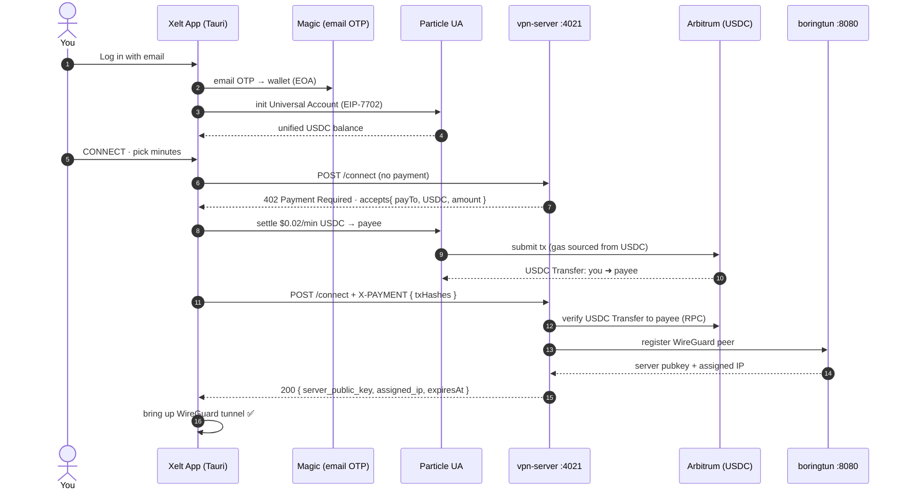

<div align="center">

# Xelt

### Pay-per-minute VPN, settled in USDC on Arbitrum.

No accounts. No subscriptions. No signup — just an email.
Pay a micro-amount over the [x402](https://x402.org) HTTP-payment protocol and get an
encrypted **WireGuard** tunnel for exactly the minutes you bought.

`x402` · `Particle Universal Accounts` · `EIP-7702` · `Magic` · `Arbitrum` · `USDC` · `WireGuard` · `Tauri`

<sub>Built for the **UXmaxx** hackathon — Particle Network **Universal Accounts** track.</sub>

</div>

---

## Why Xelt

Traditional VPNs want an account, a card, and a monthly plan — even for ten minutes at an
airport. Xelt removes all of it:

- **🔑 No identity** — log in with just an email (a [Magic](https://magic.link) embedded
  wallet is created for you). The payment *is* the auth; there's nothing to "sign up" for.
- **⏱ Pay per minute** — buy 1 minute or 60. The session auto-expires when the time is up.
- **🌐 Pay from any chain** — [Particle Universal Accounts](https://developers.particle.network/)
  source your USDC across chains and settle on Arbitrum. No bridging, no gas token to hold.
- **🔒 Real encryption** — a genuine WireGuard tunnel, not a proxy.

---

## The stack

| Layer | Tech | Role |
|-------|------|------|
| **Login / wallet** | Magic | Email-OTP embedded wallet — creates the user's EOA, no seed phrase |
| **Payments** | Particle Universal Accounts (EIP-7702) | Chain-abstracted USDC settlement — pay from any chain, settle on Arbitrum, gas sourced from USDC |
| **Settlement** | Arbitrum One · USDC | Where fares land — every session is a real transfer, verifiable on Arbiscan |
| **Protocol** | x402 | HTTP `402 Payment Required` challenge that gates each session |
| **Tunnel** | WireGuard (boringtun) | The actual encrypted VPN — chain-agnostic |
| **App** | Tauri (Rust + WebView) | Cross-platform desktop client |

---

## How it works

The client logs you in with Magic, spins up a Particle Universal Account over your EOA
(EIP-7702), and settles each session in USDC on Arbitrum. The server speaks x402: it
answers an unpaid request with a `402` + price, then verifies the **on-chain USDC transfer**
before opening the tunnel.



**Why on-chain verification?** The server doesn't trust the client's word or Particle's
(sometimes lagging) indexer — it re-reads the USDC `Transfer` log on Arbitrum and checks
`to === payee` and `amount ≥ price`, with a replay guard on the tx hash. See
[`vpn-server/services/paymentVerify.ts`](vpn-server/services/paymentVerify.ts).

---

## Fund once, then per-use

You don't have to pay cross-chain on every connect. The app has a **Recharge (any chain →
Arbitrum)** action that tops up your Arbitrum USDC balance once via Universal Accounts;
after that, each `/connect` and `/renew` settles $0.02/min straight from that balance.

```
Recharge $5  ──UA──▶  Arbitrum USDC balance
                              │
     connect 5m ─▶ settle $0.10 USDC  ┐
     renew 5m   ─▶ settle $0.10 USDC  ├─ per-use, from your balance
     renew 1m   ─▶ settle $0.02 USDC  ┘
```

Each settlement carries a small Universal-Accounts network fee (~$0.028, taken in USDC — you
never need to hold ETH for gas). Pricing is `$0.02`/min by default (`PRICE_PER_MINUTE_USD`).

---

## System architecture

```
                          PAYMENT LAYER
   ┌──────────────────────────────────────────────────────────────┐
   │  Magic (email login) ─▶ Particle UA (EIP-7702)                │
   │                              │  settle USDC                   │
   │                              ▼                                │
   │        Arbitrum One ── USDC Transfer ──▶ Payee                │
   └──────────────────────────────────────────────────────────────┘
                    │  server re-verifies the transfer on-chain
                    ▼
   ┌─────────────────┐   WireGuard peer cfg    ┌──────────────────────┐
   │    Xelt App     │ ──────────────────────▶ │   vpn-server :4021    │
   │     (Tauri)     │ ◀────────────────────── │   /connect /renew ... │
   └────────┬────────┘   server pubkey + IP    └──────────┬───────────┘
            │                                              │ POST /v1/register
            │        WireGuard tunnel (UDP :51820)         ▼
            └─────────────────────────────────▶ ┌──────────────────────┐
                                                │   boringtun  :8080   │
                                                │   WireGuard server   │
                                                └──────────────────────┘
```

### Endpoints (`vpn-server`)

| Method · path | Auth | Purpose |
|---------------|------|---------|
| `POST /connect` | x402 (`402` → pay → retry) | Buy a new session |
| `POST /renew` | x402 | Extend the active session (last 30s before expiry) |
| `POST /session/clear` | free | Drop the session + WireGuard peer |
| `GET /pricing?durationMinutes=N` | free | Quote a price |
| `GET /session/:wireguardPublicKey` | free | Session status / seconds remaining |
| `GET /health` · `GET /info` | free | Health + service metadata |

---

## Repo layout

```
xelt/
├── client/                          # Tauri desktop app (React WebView + Rust core)
│   ├── src/wallet/                  #   Magic login + Particle UA settlement layer
│   │   ├── magic.ts                 #     email-OTP login → EOA + viem wallet client
│   │   ├── ua.ts                    #     Universal Accounts: balance, recharge, payExternal
│   │   ├── config.ts                #     Arbitrum / USDC / Magic + Particle keys
│   │   └── index.ts                 #     public wallet API
│   ├── src/utils/vpnFlow.ts         #   x402 connect/renew (402 → UA settle → verify → tunnel)
│   ├── src/App.tsx                  #   UI: login, balance, recharge, buy/renew minutes
│   └── src-tauri/                   #   Rust: WireGuard tunnel control + key storage
├── vpn-server/                      # x402 resource server (Hono)
│   ├── index.ts                     #   402 gate + payment verify + peer registration
│   └── services/paymentVerify.ts    #   on-chain USDC Transfer verification (Arbitrum RPC)
├── protocol/boringtun/              # WireGuard server (Rust, chain-agnostic)
└── spikes/ua-magic-7702/            # throwaway spike that proved the Magic + UA + 7702 recipe
```

---

## Quickstart

### Prerequisites

- **Rust** + **Node 20+**. On macOS, `brew install wireguard-tools` is recommended.
- A **Magic** publishable key — [dashboard.magic.link](https://dashboard.magic.link) (`pk_live_…`).
- **Particle** Project ID / Client Key / App ID — [dashboard.particle.network](https://dashboard.particle.network).
- An Arbitrum address you control to receive fares (the **payee**). To make a real payment,
  your Magic wallet needs some USDC on any supported chain (recharge pulls it to Arbitrum).

### Run it — three terminals

**Terminal 1 · WireGuard server (boringtun)** — from the repo root:

```bash
cargo build --release --features payment -p boringtun-cli
sudo WG_SUDO=1 BT_PAYMENT_SERVER=0 BT_REGISTRATION_API=1 \
  BT_HTTP_BIND=0.0.0.0:8080 BT_PUBLIC_IP=127.0.0.1 BT_WG_PORT=51820 \
  WG_LOG_LEVEL=info ./target/release/boringtun-cli utun --foreground
# verify:  curl http://127.0.0.1:8080/health
```

**Terminal 2 · x402 payment server**

```bash
cd vpn-server
cp .env.example .env         # fill in PAYEE_ADDRESS + Particle keys (see Configuration)
npm install
npm run dev                  # or: npm start
# verify:  curl http://127.0.0.1:4021/health
```

**Terminal 3 · desktop client**

```bash
cd client
cp .env.example .env.local   # fill in VITE_MAGIC_PK, VITE_PARTICLE_*, VITE_VPN_PAYEE
npm install
npm run tauri dev
```

> **macOS, first run:** after the debug binary is built, run `npm run sign:dev` once. It
> ad-hoc-signs the binary with the keychain entitlement so Magic's WebCrypto keys stay
> stable between launches (otherwise macOS re-prompts for keychain access every start). Then
> click **Always Allow** on the first prompt. See Troubleshooting.

Log in with your email → (optionally **Recharge** to fund your Arbitrum balance) → **CONNECT**,
pick minutes → it settles USDC via Universal Accounts → the tunnel comes up. ✅

---

## Configuration

### `vpn-server/.env`

| Env var | Meaning |
|---------|---------|
| `PORT` | x402 API port (default `4021`). |
| `BORINGTUN_API_URL` | boringtun registration API (`http://127.0.0.1:8080`). |
| `ARB_CHAIN_ID` | Arbitrum One chain id (`42161`). |
| `ARB_USDC_ADDRESS` | USDC on Arbitrum (`0xaf88d065e77c8cC2239327C5EDb3A432268e5831`). |
| `PAYEE_ADDRESS` | The Arbitrum address that **receives** per-use USDC. |
| `PARTICLE_PROJECT_ID` / `PARTICLE_CLIENT_KEY` / `PARTICLE_APP_ID` | Particle project keys (client-safe). |
| `PRICE_PER_MINUTE_USD` | Price per minute in USDC (default `0.02`). |
| `DEFAULT/MIN/MAX_SESSION_MINUTES` · `RENEW_WINDOW_SECONDS` | Session bounds + renew window. |

### `client/.env.local`

| Env var | Meaning |
|---------|---------|
| `VITE_SERVER_IP` | vpn-server host (`127.0.0.1` for same-machine dev). |
| `VITE_X402_API_URL` | x402 API base (optional override, `http://localhost:4021`). |
| `VITE_MAGIC_PK` | Magic publishable key (`pk_live_…`). |
| `VITE_PARTICLE_PROJECT_ID` / `VITE_PARTICLE_CLIENT_KEY` / `VITE_PARTICLE_APP_ID` | Particle client keys. |
| `VITE_ARB_CHAIN_ID` / `VITE_ARBITRUM_RPC` / `VITE_ARB_USDC_ADDRESS` | Arbitrum settlement (defaults baked into `config.ts`). |
| `VITE_VPN_PAYEE` | Same Arbitrum address as the server's `PAYEE_ADDRESS`. |

> **Mainnet-only:** the Particle UA SDK has no testnet chains, so settlement runs on
> **Arbitrum One with real USDC**. Keep amounts tiny for demos.

### Ports

| Port | Service |
|------|---------|
| `4021` | x402 payment API |
| `8080` | boringtun peer registration |
| `51820/udp` | WireGuard |
| `1420` | client (Vite dev server) |

---

## Troubleshooting

**Magic re-prompts for keychain access every launch (macOS dev)** — the dev binary's
signature changes between builds, so the keychain sees a "new" app. Run `npm run sign:dev`
after building and click **Always Allow** once. The [`Entitlements.plist`](client/src-tauri/Entitlements.plist)
grants a stable `keychain-access-group`.

**Built app won't open — "damaged"/Gatekeeper (`-43`)** — clear quarantine:
```bash
xattr -cr /path/to/Xelt.app
```

**`payment_invalid` on connect** — the server couldn't verify a USDC transfer to the payee.
Confirm `VITE_VPN_PAYEE` (client) equals `PAYEE_ADDRESS` (server) and that the settlement
actually landed on Arbiscan.

**Port `4021` already in use**
```bash
lsof -ti :4021 | xargs kill      # or: npm run dev:fresh
```

**Force-stop the Tauri app**
```bash
pkill -f "target/debug/xelt"; pkill -f "tauri dev"; pkill -f "vite"
```

---

## Notes

- **Same-machine dev** (`127.0.0.1`) is perfect for the full pay → tunnel loop. For real
  internet **egress**, run boringtun on a Linux VPS with IP forwarding + NAT.
- For same-machine demos that keep your internet alive, launch the client with
  `XELT_SPLIT_TUNNEL=1` — it brings up the tunnel without hijacking your default route.
- Every session is a real USDC transfer — look any of them up on
  [arbiscan.io](https://arbiscan.io).
